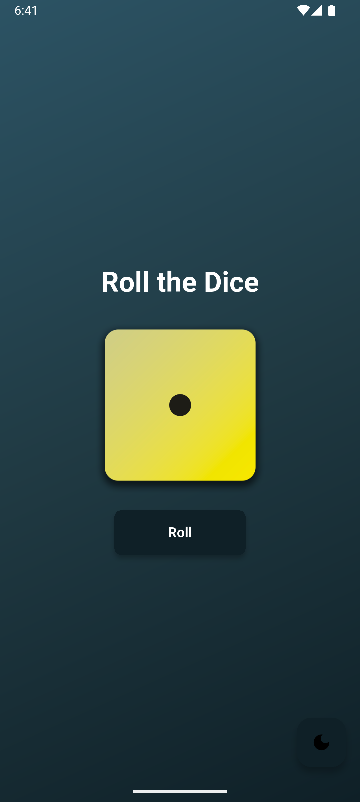
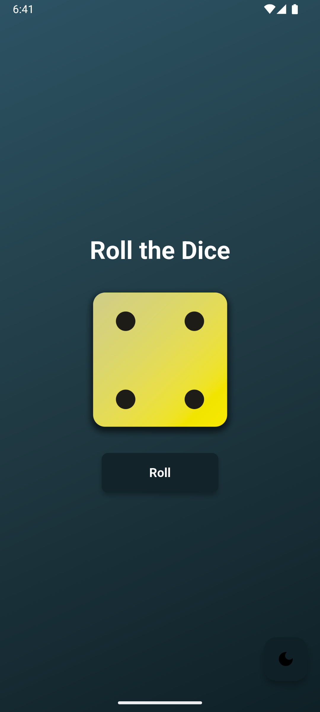

# Roll-O-Dice 🎲

Roll-O-Dice is a simple and fun Flutter application that simulates rolling a dice. It is built using Flutter and leverages the Riverpod state management library for managing the dice state. This project is perfect for beginners looking to learn Flutter or for anyone who wants to create a lightweight dice-rolling app.

---

## Features ✨

- 🎲 **Dice Rolling Simulation**: Tap a button to roll the dice and see the result instantly.
- 🖼️ **Dynamic Dice Images**: Displays the dice face corresponding to the rolled number.
- 🛠️ **State Management**: Powered by Riverpod for clean and efficient state handling.
- 🎨 **Customizable UI**: Built with Flutter's Material Design for a modern and responsive interface.

---

## Screenshots 📸

| Home Screen | Rolling Dice |
|-------------|--------------|
|  |  |

---

## Getting Started 🚀

### Prerequisites

- [Flutter SDK](https://flutter.dev/docs/get-started/install) installed on your machine.
- A code editor like [Visual Studio Code](https://code.visualstudio.com/) or [Android Studio](https://developer.android.com/studio).
- Basic knowledge of Flutter and Dart.

### Installation

1. Clone the repository:

   ```bash
   git clone https://github.com/your-username/roll-o-dice.git
   cd roll-o-dice

2. Create platform-specific folders:

    ```bash
    flutter create .

3. Install dependencies: 

    ```bash
   flutter pub get

4. Run the app:

    ```bash
   flutter run

---

## Project Structure 📂

```
rollodice/
├── android/                # Android-specific files (generated by `flutter create`)
├── ios/                    # iOS-specific files (generated by `flutter create`)
├── lib/                    # Main Flutter application code
│   ├── core/               # Core utilities and providers
│   │   ├── providers/      # Riverpod providers
│   │   └── router/         # App routing
│   ├── screens/            # UI screens
│   │   └── Home/           # Home screen widgets
│   └── main.dart           # App entry point
├── assets/                 # App assets (images, etc.)
│   └── images/             # Dice images
├── pubspec.yaml            # Project configuration
└── README.md               # Project documentation
```

---

## How It Works 🛠️

1. State Management: The app uses Riverpod to manage the dice state. The diceProvider is a StateNotifierProvider that updates the dice value when the "Roll" button is pressed.

2. Dynamic UI: The dice face is dynamically updated using the diceState value, which corresponds to the image file name in the assets/images directory.

3. Flutter Widgets: The app uses Flutter's ConsumerWidget to rebuild the UI whenever the dice state changes.

---

## Key Files 📄

show_dice.dart: Contains the main UI for displaying the dice and the roll button.

dice_notifier.dart: Manages the dice state and provides the logic for rolling the dice.

app_routes.dart: Defines the app's routing configuration.

---

## Assets 🎨

```
    flutter: 
      assets:
       - assets/images/
```

---

 ## Contributing 🤝

 Contributions are welcome! If you'd like to improve this project, feel free to fork the repository and submit a pull request.

---

 ## License 📜

    This project is licensed under the MIT License.

Enjoy rolling the dice! 🎲


